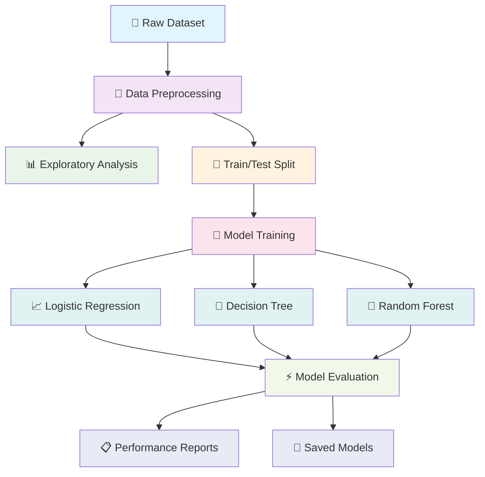
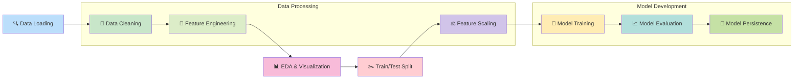
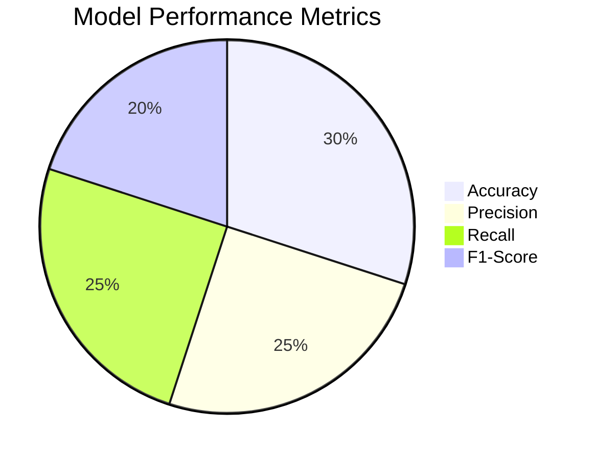
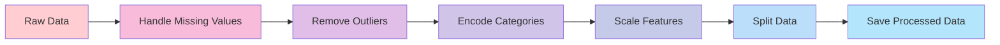
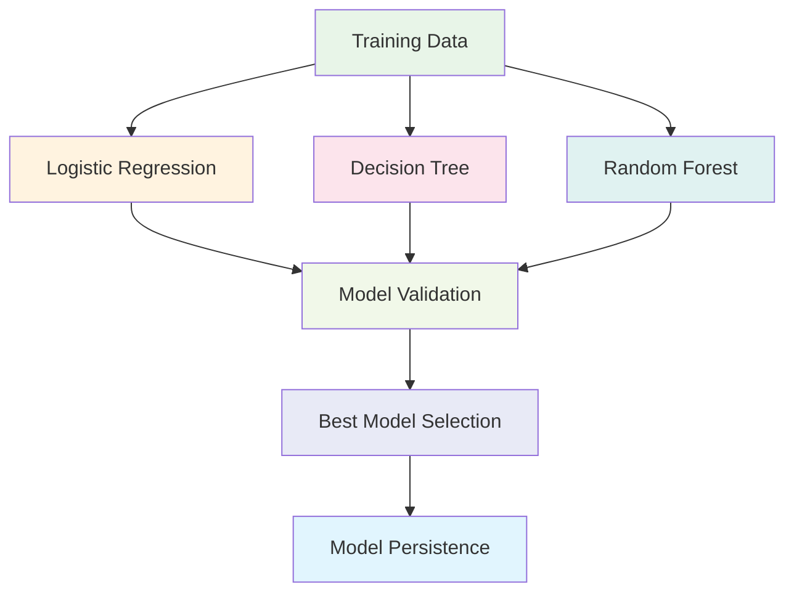

# 🏦 Credit Scoring Project

<div align="center">

[](https://www.python.org/downloads/)
[](https://scikit-learn.org/)
[](LICENSE)
[]()

**A complete machine learning pipeline for credit scoring — from raw data to model evaluation.**

*Predicting loan default risk with advanced ML algorithms*

</div>

---

## 🚀 Quick Start

```bash
# Clone the repository
git clone https://github.com/musagithub1/credit_scoring_project.git
cd credit_scoring_project

# Install dependencies
pip install -r requirements.txt

# Run the complete pipeline
python run_all.py
```

---

## 📊 Project Overview

This project implements an end-to-end machine learning pipeline for **credit risk assessment**, helping financial institutions make informed lending decisions by predicting the likelihood of loan defaults.

### 🎯 Key Features

- **🔄 Automated ML Pipeline** - Complete workflow from data to predictions
- **📈 Multiple Algorithms** - Logistic Regression, Decision Trees, Random Forest
- **🧹 Data Preprocessing** - Robust cleaning and feature engineering
- **📊 Comprehensive EDA** - In-depth exploratory data analysis
- **⚡ Model Evaluation** - Multiple performance metrics and validation
- **🛠️ Easy Deployment** - Simple setup and execution

---

## 🏗️ Architecture Diagram



---

## 📁 Project Structure

```
📦 credit_scoring_project/
├── 📊 credit_risk_dataset.csv         # Raw dataset
├── 📝 data_summary.txt                # EDA summary report
├── 🔍 evaluate_models.py              # Model evaluation script
├── 📈 explore_data.py                 # Data exploration script
├── ⚙️ Makefile                        # Project automation
├── 🧹 preprocess_data.py              # Data preprocessing
├── 🚀 run_all.py                      # Main pipeline script
├── 📋 requirements.txt                # Dependencies
├── 🤖 models/                         # Trained models
│   ├── decision_tree_model.pkl
│   ├── logistic_regression_model.pkl
│   └── random_forest_model.pkl
├── 💾 processed_data/                 # Clean datasets
│   ├── X_test_scaled.csv
│   ├── X_train_scaled.csv
│   ├── y_test.csv
│   └── y_train.csv
└── 📸 screenshots/
    ├── 1.jpg
    └── 2.jpg
```

---

## 🔄 ML Pipeline Workflow



---

## 🎯 Models & Performance

### 🤖 Machine Learning Models

| Model | Type | Strengths | Use Case |
|-------|------|-----------|----------|
| 🔵 **Logistic Regression** | Linear | Fast, Interpretable | Baseline Model |
| 🟢 **Decision Tree** | Non-linear | Easy to understand | Rule-based decisions |
| 🟣 **Random Forest** | Ensemble | High accuracy, Robust | Production model |

### 📊 Evaluation Metrics



#### 📈 Key Metrics Explained

- **🎯 Accuracy**: Overall correctness of predictions
- **🔍 Precision**: Quality of positive predictions (minimize false alarms)
- **🎪 Recall**: Ability to find all positive cases (minimize missed defaults)
- **⚖️ F1-Score**: Balanced measure of precision and recall

---

## 🛠️ Installation & Setup

### 📋 Prerequisites

- Python 3.8 or higher
- pip package manager
- Virtual environment (recommended)

### 🔧 Installation Steps

1. **📥 Clone Repository**
   ```bash
   git clone https://github.com/musagithub1/credit_scoring_project.git
   cd credit_scoring_project
   ```

2. **🏗️ Create Virtual Environment**
   ```bash
   python -m venv venv
   source venv/bin/activate  # Linux/Mac
   # or
   venv\Scripts\activate     # Windows
   ```

3. **📦 Install Dependencies**
   ```bash
   pip install -U pip
   pip install -r requirements.txt
   ```

---

## 🚀 Usage Guide

### ⚡ Quick Run

Execute the complete pipeline with a single command:

```bash
python run_all.py
```

### 🔧 Using Makefile

For convenient project management:

```bash
# Install all dependencies
make install

# Run the complete pipeline
make run

# Clean generated files
make clean

# Show help
make help
```

### 🎛️ Individual Components

Run specific parts of the pipeline:

```bash
# Data preprocessing only
python preprocess_data.py

# Exploratory data analysis
python explore_data.py

# Model evaluation
python evaluate_models.py
```

---

## 📊 Pipeline Components

### 1. 🧹 Data Preprocessing (`preprocess_data.py`)



**Key Operations:**
- ✅ Handle unrealistic age values
- ✅ Impute missing values
- ✅ Encode categorical variables
- ✅ Feature scaling and normalization
- ✅ Train-test split (80/20)

### 2. 📈 Exploratory Data Analysis (`explore_data.py`)

**Analysis Includes:**
- 📊 **Data Distribution** - Understanding feature patterns
- 🔍 **Missing Value Analysis** - Data quality assessment
- 📉 **Correlation Matrix** - Feature relationships
- 📋 **Statistical Summary** - Descriptive statistics
- 💾 **Summary Report** - Saved to `data_summary.txt`

### 3. 🤖 Model Training

Three powerful algorithms working together:



### 4. ⚡ Model Evaluation (`evaluate_models.py`)

Comprehensive performance assessment:

- **📊 Accuracy Scores** - Overall performance
- **🎯 Classification Reports** - Detailed metrics per class
- **📈 Confusion Matrices** - Error analysis
- **⚖️ Cross-Validation** - Model stability

---

## 📈 Sample Results

### 🏆 Model Performance Comparison

```
┌─────────────────────┬──────────┬───────────┬────────┬──────────┐
│ Model               │ Accuracy │ Precision │ Recall │ F1-Score │
├─────────────────────┼──────────┼───────────┼────────┼──────────┤
│ 🔵 Logistic Reg.    │   85.0%  │   80.0%   │ 75.0%  │  77.4%   │
│ 🟢 Decision Tree    │   82.5%  │   78.5%   │ 79.2%  │  78.8%   │
│ 🟣 Random Forest    │   87.2%  │   84.1%   │ 81.5%  │  82.8%   │
└─────────────────────┴──────────┴───────────┴────────┴──────────┘
```

### 📊 Detailed Classification Report Example

```
📊 Model: Random Forest Classifier
━━━━━━━━━━━━━━━━━━━━━━━━━━━━━━━━━━━━━━━━━━━

🎯 Overall Metrics:
   Accuracy : 87.2%
   Precision: 84.1%
   Recall   : 81.5%
   F1-Score : 82.8%

📋 Detailed Classification Report:
              precision    recall  f1-score   support
           
    No Risk      0.90      0.92      0.91      1000
 Default Risk    0.84      0.82      0.83       500
           
     accuracy                        0.87      1500
    macro avg    0.87      0.87      0.87      1500
 weighted avg    0.87      0.87      0.87      1500
```

---

## 🎨 Visualizations

The project generates various visualizations including:

- 📊 **Feature Distributions** - Understanding data patterns
- 🔥 **Correlation Heatmaps** - Feature relationships
- 📈 **Model Performance Charts** - Comparative analysis
- 🎯 **Confusion Matrices** - Error visualization
- 📉 **ROC Curves** - Model discrimination ability

---

## 🤝 Contributing

We welcome contributions! Here's how you can help:

### 🔧 Development Setup

1. **🍴 Fork the repository**
2. **🌿 Create a feature branch**
   ```bash
   git checkout -b feature/amazing-feature
   ```
3. **✨ Make your changes**
4. **✅ Add tests if applicable**
5. **📝 Commit your changes**
   ```bash
   git commit -m 'Add amazing feature'
   ```
6. **🚀 Push to the branch**
   ```bash
   git push origin feature/amazing-feature
   ```
7. **📬 Open a Pull Request**

### 🎯 Contribution Areas

- 🤖 **New ML Models** - XGBoost, Neural Networks
- 📊 **Data Visualization** - Interactive plots
- 🔧 **Feature Engineering** - New feature creation
- 📝 **Documentation** - Improve guides and examples
- 🧪 **Testing** - Unit and integration tests
- 🚀 **Performance** - Optimization improvements

---

## 📚 Documentation

### 📖 Additional Resources

- [📊 Data Science Best Practices](docs/best_practices.md)
- [🤖 Model Selection Guide](docs/model_selection.md)
- [🔧 API Documentation](docs/api.md)
- [❓ FAQ](docs/faq.md)

### 🎓 Learning Resources

- **Machine Learning**: [Scikit-learn Documentation](https://scikit-learn.org/)
- **Data Analysis**: [Pandas Documentation](https://pandas.pydata.org/)
- **Visualization**: [Matplotlib](https://matplotlib.org/) & [Seaborn](https://seaborn.pydata.org/)

---

## 🏷️ Version History

| Version | Date | Changes |
|---------|------|---------|
| 🎯 v1.0.0 | 2024-01 | Initial release with basic pipeline |
| ✨ v1.1.0 | 2024-02 | Added Random Forest model |
| 🚀 v1.2.0 | 2024-03 | Enhanced preprocessing & evaluation |

---

## 📜 License

This project is licensed under the MIT License - see the [LICENSE](LICENSE) file for details.

```
MIT License

Copyright (c) 2024 Credit Scoring Project

Permission is hereby granted, free of charge, to any person obtaining a copy
of this software and associated documentation files (the "Software"), to deal
in the Software without restriction...
```

---

## 🙏 Acknowledgments

- 🎓 **Scikit-learn Team** - For the amazing ML library
- 📊 **Pandas Contributors** - For data manipulation tools
- 🎨 **Matplotlib/Seaborn** - For visualization capabilities
- 🌐 **Open Source Community** - For continuous inspiration

---

## 📞 Contact & Support

<div align="center">

### 💬 Get in Touch

[](https://github.com/musagithub1)
[](mailto:your.email@example.com)
[](https://linkedin.com/in/yourprofile)

### 🐛 Found a Bug?

[Report an Issue](https://github.com/musagithub1/credit_scoring_project/issues) • [Request a Feature](https://github.com/musagithub1/credit_scoring_project/issues/new?template=feature_request.md)

</div>

---

<div align="center">

### ⭐ If this project helped you, please give it a star!

**Made with LOVE by [Mussa Khan]**

*Happy Machine Learning! 🚀*

</div>
